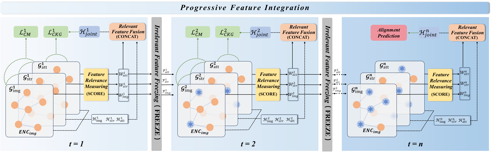
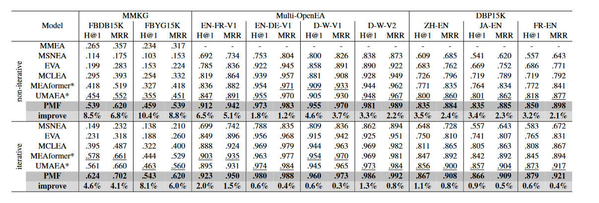

# PMF: Progressively Modality Freezing for Multi-Modal Entity Alignment
**The Offical Code for Our Paper：**[Progressively Modality Freezing for Multi-Modal Entity Alignment](https://arxiv.org/abs/2407.16168)**, ACL2024**.

## 📰Model Overview

We presented the Progressive Modality Freezing (PMF) model to advance Multi-Modal Entity Alignment. 

By measuring and evaluating the relevance of various modalities, PMF progressively freezes features deemed less critical, thereby facilitating the integration and consistency of multi-modal features. Furthermore, we introduced a unified training objective tailored to foster a harmonious contrast between KGs and modalities. 

Empirical evaluations on 9 sub-datasets affirm the superiority of PMF.



## 🛠️Install

```bash
>> cd PMF-MMEA
>> pip install -r requirements.txt
```

### details

```
Python (>=3.7 )
Pytorch (>= 1.7.0)
numpy (>= 1.19.2)
easydict (>= 1.10)
unidecode (>= 1.3.7)
tensorboard (>= 2.11.2)
```

## 📂Dataset

- We assessed the effectiveness of our proposed method using three publicly available MMEA datasets: **DBP15K, MMKG, Multi-OpenEA**
- Download from [GoogleDrive](https://drive.google.com/file/d/14CMfyg9q6ddnXGlxrj96RQZhbX9kwqJ6/view?usp=sharing) (1.3G) and unzip it to make those files **satisfy the following file hierarchy**:

```bash
ROOTs
├── data
│   └── MMKG
└── PMF-MMEA
```
MMKG details：
```bash
mmkg
├─DBP15K
│  ├─fr_en
│  │      ent_ids_1
│  │      ent_ids_2
│  │      ill_ent_ids
│  │      training_attrs_1
│  │      training_attrs_2
│  │      triples_1
│  │      triples_2
│  │
│  ├─ja_en
│  │      ent_ids_1
│  │      ent_ids_2
│  │      ill_ent_ids
│  │      training_attrs_1
│  │      training_attrs_2
│  │      triples_1
│  │      triples_2
│  │
│  ├─translated_ent_name
│  │      dbp_fr_en.json
│  │      dbp_ja_en.json
│  │      dbp_zh_en.json
│  │
│  └─zh_en
│          ent_ids_1
│          ent_ids_2
│          ill_ent_ids
│          training_attrs_1
│          training_attrs_2
│          triples_1
│          triples_2
│
├─FBDB15K
│  └─norm
│          ent_ids_1
│          ent_ids_2
│          ill_ent_ids
│          training_attrs_1
│          training_attrs_2
│          triples_1
│          triples_2
│
├─FBYG15K
│  └─norm
│          ent_ids_1
│          ent_ids_2
│          ill_ent_ids
│          training_attrs_1
│          training_attrs_2
│          triples_1
│          triples_2
│
├─OpenEA
│  ├─OEA_D_W_15K_V1
│  │      ent_ids_1
│  │      ent_ids_2
│  │      ill_ent_ids
│  │      rel_ids
│  │      training_attrs_1
│  │      training_attrs_2
│  │      triples_1
│  │      triples_2
│  │
│  ├─OEA_D_W_15K_V2
│  │      ent_ids_1
│  │      ent_ids_2
│  │      ill_ent_ids
│  │      rel_ids
│  │      training_attrs_1
│  │      training_attrs_2
│  │      triples_1
│  │      triples_2
│  │
│  ├─OEA_EN_DE_15K_V1
│  │      ent_ids_1
│  │      ent_ids_2
│  │      ill_ent_ids
│  │      rel_ids
│  │      training_attrs_1
│  │      training_attrs_2
│  │      triples_1
│  │      triples_2
│  │
│  └─OEA_EN_FR_15K_V1
│          ent_ids_1
│          ent_ids_2
│          ill_ent_ids
│          rel_ids
│          training_attrs_1
│          training_attrs_2
│          triples_1
│          triples_2
│
└─pkls
        dbpedia_wikidata_15k_dense_GA_id_img_feature_dict.pkl
        dbpedia_wikidata_15k_norm_GA_id_img_feature_dict.pkl
        FBDB15K_id_img_feature_dict.pkl
        FBYG15K_id_img_feature_dict.pkl
        fr_en_GA_id_img_feature_dict.pkl
        ja_en_GA_id_img_feature_dict.pkl
        OEA_D_W_15K_V1_id_img_feature_dict.pkl
        OEA_D_W_15K_V2_id_img_feature_dict.pkl
        OEA_EN_DE_15K_V1_id_img_feature_dict.pkl
        OEA_EN_FR_15K_V1_id_img_feature_dict.pkl
        zh_en_GA_id_img_feature_dict.pkl
```
## ⛷️Train

### quick start

```bash
# DBP15K
>> bash run_dbp.sh 
# MMKG
>> bash run_fb.sh
# Multi-OpenEA
>> bash run_oea.sh
```

## 🥇Results

Model performance report can be found in the file `PMF-MMEA/results/report.csv`



## 📝Cite

```
@inproceedings{huang2024progressively,
  title={Progressively Modality Freezing for Multi-Modal Entity Alignment},
  author={Huang, Yani and Zhang, Xuefeng and Zhang, Richong and Chen, Junfan and Kim, Jaein},
  booktitle={Proceedings of the 62nd Annual Meeting of the Association for Computational Linguistics (Volume 1: Long Papers)},
  pages={3477--3489},
  year={2024}
}
```

## 🫶**Acknowledgement**
This work was supported by CCSE, School of Computer Science and Engineering, Beihang University, Beijing, China.
Our codes are modified based on [MEAformer](https://github.com/zjukg/MEAformer), and we also appreciate [MCLEA](https://github.com/lzxlin/MCLEA), [MSNEA](https://github.com/liyichen-cly/MSNEA), [EVA](https://github.com/cambridgeltl/eva), [MMEA](https://github.com/liyichen-cly/MMEA) and many other related works for their open-source contributions.